# VRAeroScan — User's Manual

VRAeroScan is a **finder for what is above you**. Wear Viture Pro XR glasses, look up, and
see labelled markers sitting on the real sky at the real bearing and height of every aircraft
and satellite overhead: callsign, type and altitude for planes; name, height and range for
satellites. Look at a moving light and know what it is, or find out where to look for the
International Space Station thirty seconds before it clears the roofline.

The glasses are transparent: the real sky is the background, and the app draws only an
outline overlay. It is not VR and not video passthrough.

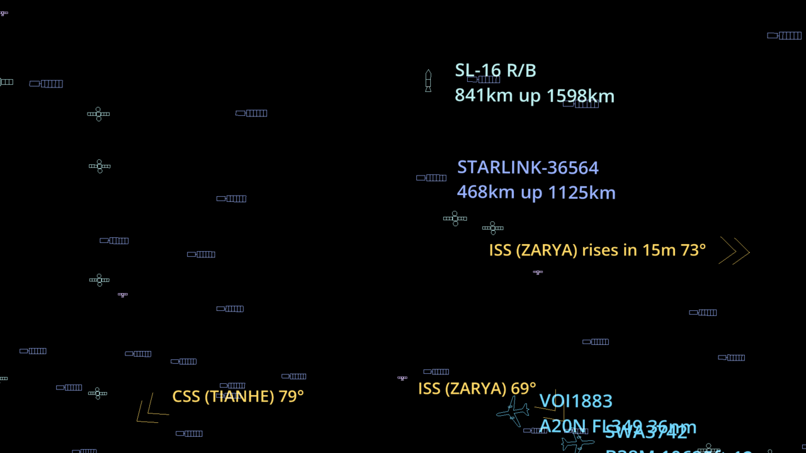

*What the glasses show (a screen capture of the display; through the real glasses the black is
clear). Satellites are outline icons; aircraft carry a two-line label; the chevrons at the edge
of the view point at the ISS and the Chinese station, with how many degrees away they are.*

> Everything in this manual is about *using* the app. For how it is built and why, see
> `PROJECT_NOTES.md`.

---

## 1. What you need

| | |
|---|---|
| **Glasses** | Viture Pro XR, connected to the phone by USB-C. Put them in **3D (side-by-side) mode**. |
| **Phone** | An Android phone that outputs video over USB-C, with GPS and an internet connection. Tested on a OnePlus 7 Pro running Android 16. |
| **Permissions** | Location (your position is the origin of every direction) and, on first connection, USB access to the glasses. |
| **Data** | Aircraft come from adsb.lol (free, ODbL); satellite orbits come from CelesTrak (free). The app needs the internet for both; satellite orbits are cached on the phone. |

The glasses have no computer inside. The phone does all the work, and the glasses are a
display and a head-motion sensor on the end of a cable.

---

## 2. Installing and starting the app

**Install.** Download the APK (for example `VRAeroScan-0.1.1.apk`) from the
[latest release](https://github.com/parheliatech/VRAeroScan/releases/latest) onto the phone and
open it (Android will ask you to allow installs from your browser or file manager), or from a
computer run `adb install -r VRAeroScan-0.1.1.apk`. A newer release installs over an older one. The APK is for 64-bit ARM phones, is signed
with a debug key, and includes Viture's glasses libraries so it can talk to the glasses. The first
time you open **VRAeroScan**, it asks for **Location** on the phone's screen: allow it.
Without a position the app draws the sky for a built-in default place, and the panel says so in
capitals (`NO GPS FIX`).

**Start.**

1. Plug the glasses into the phone and put them in 3D mode.
2. On the phone, open **VRAeroScan**. It finds the glasses and starts there. (Without the
   glasses plugged in, it says so and starts on the phone's screen instead.)
3. The first time (and after a phone reboot), Android asks *"Allow VRAeroScan to access the
   VITURE glasses?"*. Tick **use by default** and tap **OK**.
4. If the glasses stay black, look at the phone for *"Mirror to external display?"* and answer
   it. Android blocks a new display until you do.
5. A few seconds later the **control panel** opens on the phone's screen. The app itself keeps
   running on the glasses.

> **Plug the glasses in before you open the app.** If the app is already running on the phone's
> screen when they go in, the glasses only mirror it and the control panel never appears; the
> app says so. Open VRAeroScan again from its icon and it moves to the glasses.

Keep the phone's screen on and in your hand. It is not in view, so the panel is built to be
used by feel.

---

## 3. First thing outdoors: set north

The glasses' motion sensor knows which way is up but not which way is north. Until you tell
it, every marker is rotated by an unknown amount. **Set north first, and set it again
whenever the markers no longer line up with the real sky.**

You will see a faint **ghost N** on the horizon, with a dashed line climbing from it and
labelled ticks at 10°, 20°, 30°, 45° and 60° of elevation. E, S and W are fainter. The ghost N
is your readout: when it sits on true north, the sky is aligned.

There are five ways to set north. **None depends on another**, so use whichever the weather
and your surroundings allow.

### 3.1 Face something you know is north
Look at a landmark you know is due north, then on the phone's **North** tab tap
**I'm facing north**. Crude but dependable, and better than a phone compass near electronics.

### 3.2 Drag the sky until the ghost N is on north
On the **North** tab, drag left or right on the big pad to turn the sky. Two fingers move it
in fine steps. While you drag, the ghost markers brighten and the aircraft dim, so the N
stands out. Stop when the N sits on true north.

For small corrections use the buttons: **← 1°**, **← 0.1°**, **0.1° →**, **1° →**. The sky
moves the way the arrow points.

### 3.3 Sight the pole star (clear night, optional)
1. On the **North** tab, tap **Sight the pole star (clear sky)**.
2. A **circle** appears in the middle of the glasses, with a prompt telling you how many
   degrees up the star is and which way it lies, and how far up you are looking now. The
   same text appears, in capitals, in the panel's status line.
3. Turn your head until the star is **inside the circle**, then tap the pad.

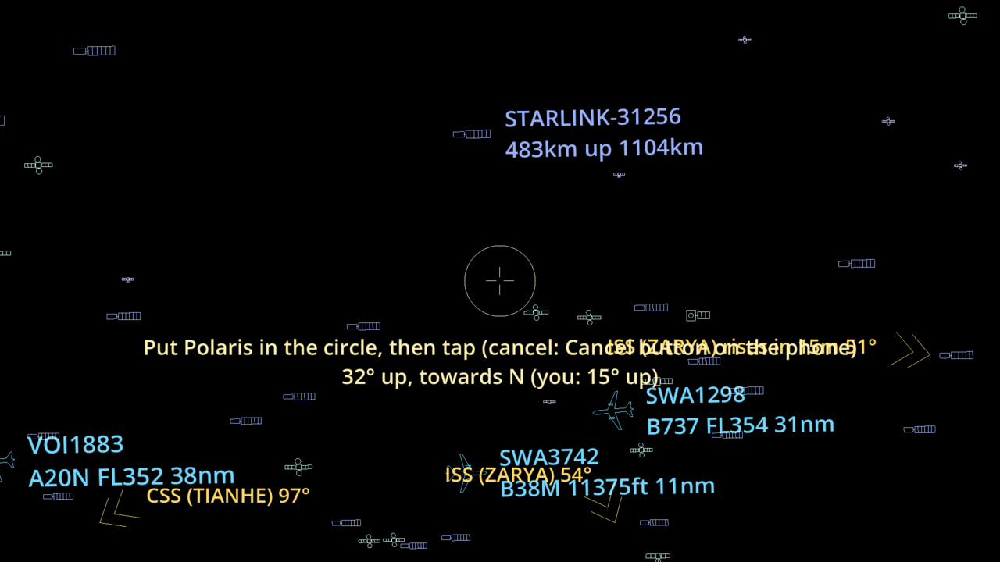

The app knows exactly where the star is from your position and the time, so one tap tells it
which way you face. Head tilt does not matter.

- **In the north** the star is **Polaris**. It is about 0.65° off the true pole, so the app
  works out where it actually is rather than assuming due north.
- **In the south** it is **Sigma Octantis**. It is faint (magnitude 5.4) and needs a dark
  sky; the prompt warns you.
- **Near the equator** the pole star sits on the horizon. Below 3° up, the app declines and
  shows a notice. Use another method.
- **To cancel** without setting anything, tap **Cancel sighting** (the same button), or press
  Esc on a keyboard. A tap on the pad *takes* the sighting, so use the phone button when you
  want out. An unfinished sighting times out after two minutes.

Expect to land within about a degree: the circle is about 1.5° in radius.

### 3.4 Sight your shadow (sunny day, optional)
A shadow points directly away from the Sun, and the app knows exactly where the Sun is from
your position and the time. So looking along a shadow tells it which way you face.

> **Never look at the Sun, through the glasses or otherwise.** The glasses dim, but they are
> not a solar filter. This method only ever has you look at the ground.

1. Stand with the Sun behind you. On the **North** tab, tap **Sight your shadow (sunny day)**.
2. A dashed line appears up the middle of the glasses, with a prompt saying where the Sun is
   and which way shadows point.
3. Look down along your shadow, or better the shadow of a pole, a lamppost or a wall's
   vertical edge (straighter than a person's), and lay the dashed line along it.
   Look towards the shadow's far end, not straight down at your feet.
4. Tap the pad.

- Head tilt does not matter; only the direction you look in counts.
- It needs the Sun between 3° and 75° up. Below that there are no useful shadows; above it
  (around midday in summer) shadows are too short to point anywhere, and the app says so.
  Mid-morning and mid-afternoon are best.
- Looking within about 14° of straight down gives no direction, so that tap is refused with
  a hint and the sighting carries on.
- **To cancel**, tap **Cancel sighting** (the same button), or press Esc. It times out after
  two minutes.

Expect a degree or two: the limit is how straight the shadow is and how well you line up with
it. The app's Sun matches an independent astronomy library (Skyfield) to 0.006°.

### 3.5 From the glasses menu
Open the menu (§6) and choose **Set north ›**. That page has **Face north, then tap…** (the menu
closes, you face true north, and you tap the pad), **Sight pole star…**, **Sight your
shadow…**, and the four sky nudges.

After any fix, the panel's status line shows how it was set and how long ago
(*Calibrated 40s ago*).

---

## 4. The control panel (on the phone)

From the top, the panel has:

- **The status box**, on every tab: your heading, the calibration, the viewpoint, your position
  (with its accuracy, and its age when it is over a minute old), and the aircraft and
  satellite counts or what is wrong with a feed. Its last line says what is going on now: a
  sighting, or what the identify circle has found. It always takes the same space, so the
  buttons below never move.
- **◎ Identify**, on every tab: turns the identify circle on and off (§5).
- **Three tabs**, one for each job: **North** (set it), **Show** (what is drawn) and **View**
  (where you look from).
- **The pad**, at the bottom of every tab: **tap** to open the glasses menu, or to choose an item
  once it is open; **drag** left or right to turn the sky (two fingers for fine).

What is on (the tab you are on, the groups shown, the current view) is lit blue. Everything
on the panel is also in the glasses menu, organised the same way.

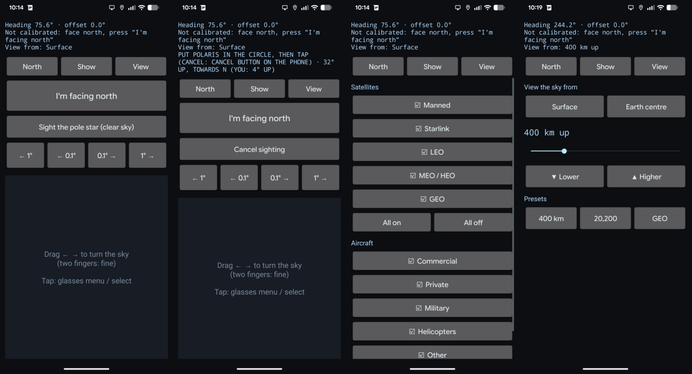

*From the left: the North tab (with Identify on, and what it found in the status box), the Show
tab and the View tab. During a pole-star sighting the star button becomes **Cancel sighting**
(lit).*

### North tab: set north
**I'm facing north**, **Sight the pole star (clear sky)**, **Sight your shadow (sunny day)**,
and the four nudge buttons (§3).

### Show tab: what is drawn
Tap a row to switch it on (☑) or off (☐).

**Satellites**

| Kind | What it is |
|---|---|
| Manned | Space stations and crewed or cargo craft docked to them (ISS, Tiangong) |
| Starlink | Starlink constellation (about 11,000 satellites) |
| LEO | Everything else in low Earth orbit |
| MEO / HEO | Between low and geostationary, including GPS and Molniya orbits |
| GEO | Geostationary |

**Aircraft**

| Group | What it is |
|---|---|
| Commercial | Airliners and cargo jets |
| Private | General aviation and business jets |
| Military | Military aircraft (identified by type and callsign) |
| Helicopters | Rotorcraft (a military helicopter appears under either group) |
| Other | Gliders, drones, and anything the app could not classify |

**All on** and **All off** are under each list.

**Label size:** **Small**, **Medium** or **Large** text on every marker, at the end of the tab.

### View tab: where you look from
- **Surface**: your actual position (the default).
- **Earth centre**: look out from the middle of the planet. There is no horizon, and every
  satellite and aircraft is in view at once. North is still north.
- **Altitude**: float above your spot at any height from the ground up to **geostationary
  orbit, 35,786 km**. Use the slider (fine near the ground, coarse near GEO), **▼ Lower** and
  **▲ Higher** (each step is ×1.5), or the presets **400 km** (the ISS), **20,200 km** (GPS)
  and **GEO**.

Altitude is measured above sea level (the WGS84 ellipsoid) at your latitude and longitude.
While you view from the surface or the centre, the slider is dimmed but keeps its last height;
moving it switches to that height.

**Your choices are kept.** What is shown, where you view from and the label size are saved on
the phone and come back the next time you start the app. North is not: the glasses' heading
starts afresh each time, so set north every session.
The status line at the top of the panel names the viewpoint (`View from: 400 km up`).

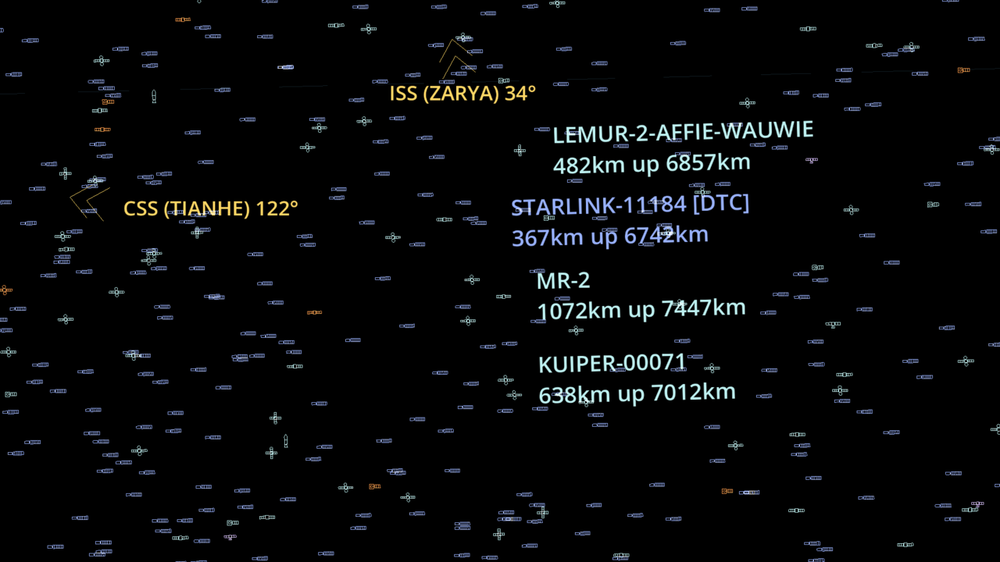

*From the Earth's centre. Labels give the satellite's height above the Earth and its
distance from you, which is now measured from the middle of the planet (about 6,700 km for a
satellite at 370 km). The ISS and CSS pointers remain, but there are no rise markers.*

When you are off the ground the app changes how it behaves, because the horizon no longer
means anything:

- Aircraft are no longer hidden for being below the horizon or beyond the usual range. The
  feed's search circle widens to its maximum (250 nautical miles).
- Pass predictions and rise markers (§5) are switched off.
- Satellites re-position when you change height, spread over a moment. Expect the diamonds
  to settle after you stop moving the slider.

---

## 5. Reading the sky

Everything is drawn as **outlines**, never fills, and black is invisible on a see-through
display. Colour says **who**, shape says **what**.

### Identify: what is that?
Tap **◎ Identify** on the phone (or choose **Identify** in the glasses menu). A circle with four
short ticks appears in the middle of the glasses. Turn your head to put an aircraft or a
satellite in it: a card beside the circle describes the one nearest the centre. Tap
**◎ Identify** again to turn it off.

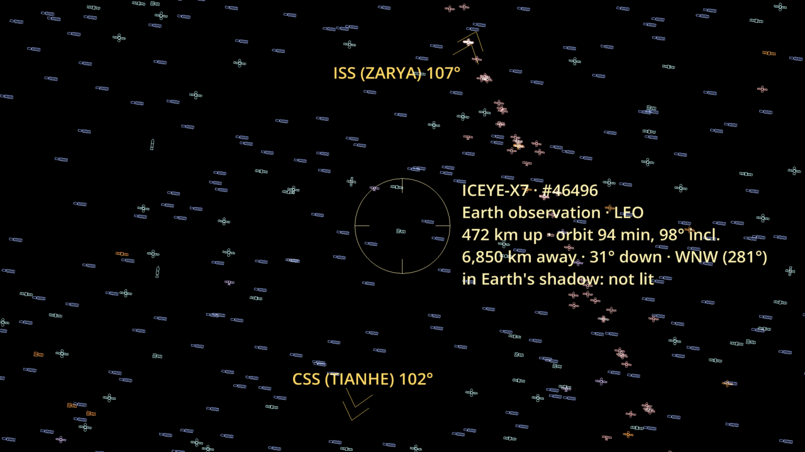

*The circle on ICEYE-X7, seen here from the Earth's centre.*

| For an aircraft, the card shows | For a satellite, the card shows |
|---|---|
| Callsign and registration | Name and catalogue number |
| Type code and kind (for example `B737 · Commercial Jet`) | What it is and its group (for example `Earth observation · LEO`), and *military* when it is |
| Altitude, ground speed and direction of travel | Height above the Earth, orbital period and inclination |
| Distance, how high it is in your sky, and its compass direction | Distance, how high it is in your sky, and its compass direction |
| Its ICAO address and how old the position is | Whether it is in sunlight or in Earth's shadow |

- The circle is 2.5° in radius. When nothing is in it, the card says so; the circle is
  brighter when it has found something.
- Only what is drawn can be identified: kinds and groups switched off on the **Show** tab are
  ignored.
- The phone's status box names what is in the circle too (`IDENTIFY: ISS (ZARYA) · #25544`).
- While it is on, the small labels that normally appear near the middle of the view are hidden;
  the card replaces them. The circle steps aside while the glasses menu is open or during a
  north or pole-star sighting, and comes back afterwards.

### Aircraft
A label with two lines: callsign (or registration), then type, altitude and distance, for
example `DAL123 / A321 FL350 24nm`. Altitudes of 18,000 ft and up are flight levels; below that
they are feet. The icon's nose points the way the aircraft is actually moving across *your*
sky.

| Colour | Meaning |
|---|---|
| Cyan | Commercial |
| Green | Private |
| Amber | Military |
| Magenta | Helicopter |
| Yellow | Glider or drone |
| Grey | Unknown |

The shape says what kind of aircraft it is. It is chosen from the aircraft's ICAO type code
(for example `A321`, `C172`) and its ADS-B size category; the colour (above) is separate and
says who flies it. The icons are drawn here in white; in the glasses they take the colour.

| Icon | Name | Shown for |
|---|---|---|
|  | **Airliner** | Narrow-body jets (A320, 737, regional jets) and any jet the app cannot place more precisely. Also an aircraft with no type code whose ADS-B category says *large*. |
|  | **Heavy** | Wide-bodies and other big jets: 747, 777, 787, A330, A350, A380, and large military transports and tankers (C-17, C-5, KC-135). Drawn 25% larger than an airliner. |
|  | **Business jet** | Gulfstream, Citation, Learjet, Challenger, Falcon and the like, and other private jets of small or medium size. Engines on the rear fuselage and a T-tail. |
|  | **Fighter** | Fighters and jet trainers (F-16, F-35, F/A-18, T-38, A-10), and military jets in the *high performance* category. |
|  | **Twin propeller** | Twin-engine propeller aircraft: King Air, Baron, Twin Cessnas, Dash 8, ATR, C-130 and similar. |
|  | **Light aircraft** | Single-engine propeller aircraft (Cessna, Piper, Cirrus), and small aircraft known only by their ADS-B category. |
| 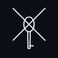 | **Helicopter** | Rotorcraft. |
|  | **Glider** | Gliders and sailplanes. |
| 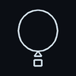 | **Balloon** | Balloons and airships. It is the one icon that does not turn: a balloon drifts, with no nose to point. |
|  | **Generic** | An aircraft the feed says too little about to tell. |

Aircraft are moved smoothly between feed updates (dead-reckoned), so they do not jump.

### Satellites
Satellites are small outline icons, each drawn as what it is. Thousands are drawn at once.
The shape comes from the satellite's name and the CelesTrak lists it appears in (navigation,
weather, communications and so on); the colour (below) says which orbit it is in.

| Icon | Name | Shown for |
|---|---|---|
| 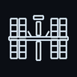 | **ISS** | The International Space Station, including its separately catalogued modules. |
|  | **Space station** | China's Tiangong station. |
| 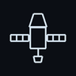 | **Capsule** | Crewed and cargo spacecraft: Crew Dragon, Dragon, Soyuz, Progress, Shenzhou, Tianzhou, Cygnus, Starliner. |
|  | **Hubble** | The Hubble Space Telescope. |
| 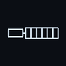 | **Starlink** | A Starlink satellite. |
| 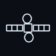 | **Communications** | Communications satellites: OneWeb, Iridium, Kuiper, Globalstar, geostationary comsats (Intelsat, SES, Viasat...). Also any geostationary satellite not otherwise known, since most are. |
| 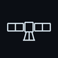 | **Navigation** | Navigation satellites: GPS, Galileo, GLONASS, BeiDou, QZSS, NavIC. |
| 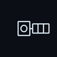 | **Earth observation** | Weather and imaging satellites: NOAA, GOES, Landsat, Sentinel, imaging and radar constellations. |
|  | **CubeSat** | CubeSats and other small satellites, including objects released from the ISS. |
|  | **Rocket body** | A spent rocket stage left in orbit (`R/B` in the name). The bright ones are often what you actually see moving. |
|  | **Debris** | A piece of debris (`DEB` in the name). |
| 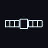 | **Generic** | Anything else. |

| Colour | Meaning |
|---|---|
| Gold | Manned |
| Periwinkle | Starlink |
| Pale cyan | LEO |
| Lavender | MEO / HEO |
| Rose | GEO |
| Amber | Military |

- **Nothing is hidden for being unseeable.** A satellite in Earth's shadow, in daylight, below
  the horizon, or on the far side of the planet is still drawn. Look down and you can see
  satellites through the ground. A satellite in shadow carries the word `shadow` in its label,
  which is information only.
- **Labels:** to keep the sky readable, only the few satellites nearest the middle of your
  view get a text label (name, height above the Earth, distance), and they never overlap.


### Pointers and passes

| Mark | Name | Meaning |
|---|---|---|
|  | **Off-screen pointer** | At the edge of the view, pointing toward a tracked satellite that is out of sight. |
|  | **Rise marker** | On the horizon where a tracked satellite will come up. |

- **Off-screen pointers.** The field of view is small (about 46° diagonal). When a tracked
  satellite is outside it, a chevron at the edge of the view points toward it, with its name
  and how many degrees away it is (`ISS (ZARYA) 141°`).
- **Rise markers.** For a tracked satellite that is below the horizon but will rise within
  20 minutes, a marker appears on the horizon where it will come up (when it is off screen,
  its pointer reads `ISS (ZARYA) rises in 17m 171°`), labelled with how long
  to wait and how high it will climb (`ISS (ZARYA) rises in 4:12 / max 67°`). The satellite's
  own icon is drawn too, below the horizon. The rise marker says where it will appear, the icon
  where it is now.
- The debug line lists the next few passes (`ISS (ZARYA) in 36m
  from W, max 51°`).

### The satellite status line
In the debug readout: how many satellites are drawn, how old the orbit data is, and a
`STALE` warning past 72 hours. Old orbit data makes satellites drift off their true positions.
One second of clock error is about 1.1° of pointing error at the ISS, so keep the phone's
clock set automatically.

---

## 6. The glasses menu

A small menu you aim with your head.

- **Open it:** tap the pad at the bottom of the phone panel, on any tab (or press **M** on a
  keyboard).
- **Aim:** it appears where you are looking and stays put in the world. A cross sits in the
  middle of your view. Turn your head so the cross lands on a row; the row is boxed.
- **Choose:** tap the pad.
- **Close it:** choose **Close**, tap while looking away from the menu, or wait 20 seconds.

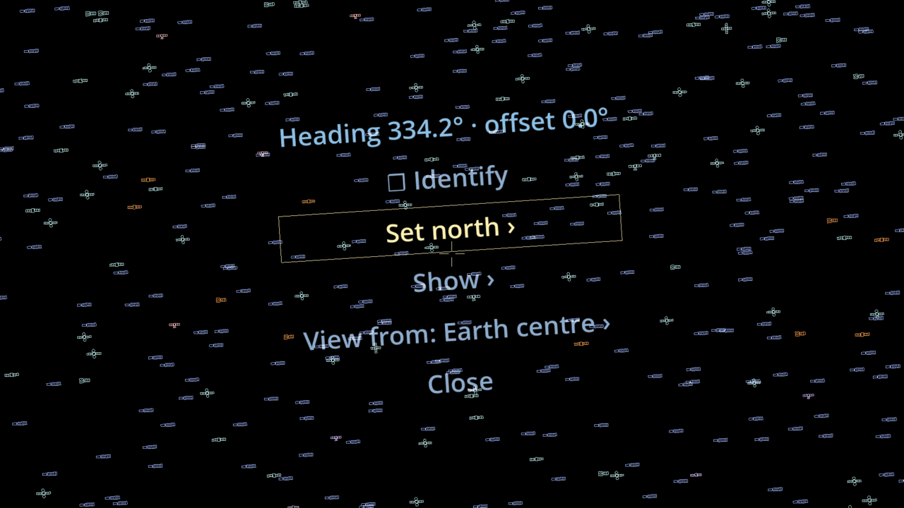

*The main page, with the cross resting on **Set north ›** (boxed). While the menu is open, satellite
labels, edge pointers and the identify circle are hidden so nothing covers its rows.*

Pages:

| Page | Rows |
|---|---|
| **Main** | A live heading readout, **☐/☑ Identify** (choosing it turns the circle on and closes the menu), **Set north ›**, **Show ›**, **View from: … ›**, **Close** |
| **Set north** | The heading readout, **Face north, then tap…**, **Sight pole star…**, **Sight your shadow…**, **Sky ← 1°**, **Sky → 1°**, **Sky ← 0.1°**, **Sky → 0.1°**, **‹ Back** |
| **Show** | **Satellites ›**, **Aircraft ›**, **Labels: …** (tap to cycle Small / Medium / Large), **‹ Back** |
| **Satellites** (under Show) | One ☑/☐ row per kind, **All on**, **All off**, **‹ Back** |
| **Aircraft** (under Show) | One ☑/☐ row per group, **All on**, **All off**, **‹ Back** |
| **View from** | **Surface**, **Earth centre**, **Higher ▲**, **Lower ▼**, 400 / 20,200 / 35,786 km presets, **‹ Back** |

Toggles and nudges keep the menu open, so you can flip several in a row. Every page fits in
the glasses' view.

---

## 7. Hints for good results

- **Your position matters.** At 1 nautical mile an error of 100 m is already about 3°. The app
  ignores phone location fixes worse than ±100 m and uses the last good one. Let the phone
  get a GPS fix before you start; the status line shows the accuracy.
- **Check against a real aircraft.** Find a plane, put it in the middle of the view, and see
  whether its marker sits on it. If not, nudge the sky until it does.
- **Check against a pass.** The ISS is the best test: it is bright and the prediction is
  accurate (the app's predictions match an independent astronomy library to about 0.2 s).
- **Altitude and distance are labelled in the units aviators use** (feet or flight level and
  nautical miles for aircraft; kilometres for satellites).
- **Bright light washes out the display.** The overlay is added to the real world, so it is
  strongest at dusk and night. In bright daylight, markers fade into the sky.

---

## 8. Troubleshooting

| Symptom | What to do |
|---|---|
| The phone shows what the glasses show and there are no controls | The app started before the glasses were plugged in (it says so for 20 seconds). Open **VRAeroScan** again from its icon. |
| "Glasses not found: starting on the phone" | Plug the glasses in, switch them to 3D mode, and open VRAeroScan again. |
| The status says `NO GPS FIX` | Allow Location for VRAeroScan (Android settings, or open VRAeroScan again), turn on location services, and give the phone a view of the sky. Until then the sky is drawn for the position shown. |
| Glasses are black | Answer *"Mirror to external display?"* on the phone. Check the glasses are in 3D mode. |
| Markers do not follow my head | Check the USB permission prompt was accepted (*use by default*). Unplug, replug, relaunch. |
| The control panel did not open | It opens only after the USB prompt is answered, a few seconds after launch. Open VRAeroScan again from its icon. |
| The status line says `no glasses on USB` | The app cannot see the glasses. Replug them. |
| Markers are all rotated the same wrong amount | North is not set, or is off. See §3. |
| Markers are wrong by a few degrees and vary | Check the GPS accuracy and that the phone clock is automatic. |
| No aircraft | Check the internet. The status shows what went wrong in place of the aircraft count. `rate-limited, retry in 30s` means adsb.lol asked the app to slow down; it waits and recovers on its own. |
| Satellite elements are `STALE` | The cached orbit data is old and could not be refreshed. Get online; the app retries every four hours. |
| Satellites seem frozen after I move the altitude slider | They are re-positioning in batches; wait a moment. |
| The pole star circle will not go away | Tap **Cancel sighting** on the phone (or Esc). See §3.3. |
| Pole star prompt says the star is only a few degrees up | You are near the equator. Set north another way. |
| "The Sun is down" or "shadows are too short" | The shadow method needs the Sun 3° to 75° up. Use another way, or wait. |
| "Look along the shadow… not straight down" | Look further out along the shadow, towards its far end, and tap again. |

---

## 9. Desktop keys (for development and testing)

When run on a computer with no glasses, a mock head tracker is used.

| Key | Action |
|---|---|
| Right-drag | Look around |
| Left-drag | Turn the sky (hold **Shift** for fine) |
| ← / → | Nudge the sky |
| **N** | "I'm facing north" |
| **Space** | The pad's tap |
| **M** | Open or close the glasses menu |
| **I** | Turn the identify circle on or off |
| **Esc** | Cancel a north, pole-star or shadow sighting |
| **[** / **]** | Step the field of view, to match the glasses' optics |

Over adb the same actions work as key events, for example `adb shell input keyevent KEYCODE_M`.

---

## 10. Building and installing

Requirements: Godot 4.7 (headless export), JDK 17, the Android SDK, and Viture's SDK libraries
in `vendor/viture/lib` (Viture makes them freely available to download; they are kept out of
this repository, which gitignores `vendor/`).

```bash
# Build the Android plugin (needs JDK 17 and vendor/viture/lib)
godot/plugins/viture_glasses/build.sh ../../VRAeroScan

# Export the APK and install it
godot --headless --path godot/VRAeroScan --export-debug "Android" vraeroscan.apk
adb install -r vraeroscan.apk

# Run the tests (3,600+ checks, headless)
godot/VRAeroScan/tests/run.sh
```

Over Wi-Fi: with the phone on USB once, run `adb tcpip 5555 && adb connect <phone-ip>:5555`.
Running Godot (export, import, tests) restarts the adb server and drops the Wi-Fi
connection, so reconnect afterwards.

To launch from a computer onto the glasses without touching the phone:

```bash
ADB=adb ADB_SERIAL=<phone-ip>:5555 godot/DisplaySpike/launch_on_glasses.sh org.vraeroscan.app
```

View the app's status line every five seconds with
`adb logcat -s godot | grep VRAEROSCAN`.

---

## 11. Data and licences

- **Aircraft:** adsb.lol public API, ODbL 1.0.
- **Satellite orbits:** CelesTrak, refreshed every four hours and cached on the phone
  (CelesTrak refuses over-frequent downloads).
- **This project:** MIT licence (see `LICENSE`). Viture's libraries, bundled in the release APK, are
  Viture's and not covered by it.
- **Code:** Godot 4 (MIT); the orbit propagator is a GDScript port of python-sgp4 (MIT). All
  icons and drawings are original to this project. No GPL assets are used.
- **Viture SDK:** Viture's glasses libraries are freely available from Viture. They are not in
  this repository's source; the release APK bundles them so it runs out of the box.

Accuracy is checked against independent references: look angles against live adsb.lol data,
the satellite chain against Skyfield (0.0006°), pass times against Skyfield (0.2 s), and the
pole star against Skyfield (0.0074°), and the Sun against Skyfield (0.006°). The validation scripts are in `tools/validation/`.
